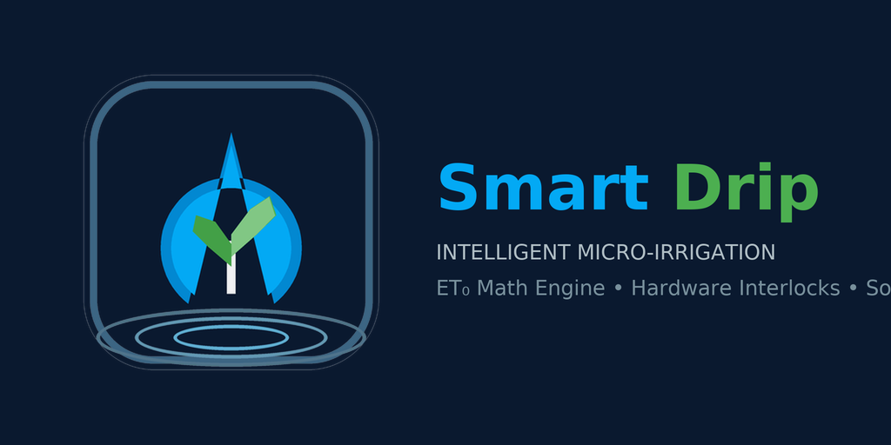

<p align="center">
  
</p>

# Smart Drip Irrigation (`smart_drip`)

[](https://github.com/JohNan/homeassistant-smart-drip/actions/workflows/ci.yml)
[](https://github.com/JohNan/homeassistant-smart-drip/actions/workflows/validate.yml)
[](https://github.com/JohNan/homeassistant-smart-drip/releases)
[](https://github.com/hacs/default)
[](LICENSE)

Production-grade Home Assistant custom integration for smart micro-drip irrigation. Combines the **Sonoff SWV-ZF2** Zigbee dual-channel smart water valve, **Tempest WeatherFlow** localized telemetry, and **Gardena 15mm Micro-Drip** infrastructure with real-time agronomic math models and hardware safety interlocks.

---

## Key Features

- **Evapotranspiration Math Model**: Nightly calculation of FAO-56 Penman-Monteith reference evapotranspiration ($ET_0$) using live localized sensor telemetry from Tempest WeatherFlow (solar radiation, temperature, relative humidity, wind speed, barometric pressure).
- **Dynamic Water Budget & Deficit Tracking**: Soil moisture deficit modeling with configurable bucket capacity, rain subtraction, and runtime derivation ($40\text{ L/h} \Rightarrow 8.33\text{ mm/h} \Rightarrow 432\text{ s/mm}$).
- **Hardware Interlocks & Solenoid Protection**:
  - Hardware mutual exclusion preventing concurrent dual-channel actuation.
  - Mandatory 10-second idle pause between channel operations for latching capacitor recharge and hydraulic pressure stabilization.
  - Automatic software safety ceiling clamped at 45 minutes ($2700\text{ s}$) with a 60-minute hardware watchdog emergency limit.
- **Runtime Reconfigurability**: Modify zone areas, emitter flow rates, rain sensors, weather providers, and switch/valve channels directly via Home Assistant Options Flow without integration restarts.
- **Dual-Domain Valve Support**: Routes actuation calls natively to standard `switch` entities (`turn_on`/`turn_off`) or specialized smart `valve` entities (`open_valve`/`close_valve`).
- **External Manual Actuation Tracking**: Detects when valves are manually actuated outside the integration (e.g. physical buttons or third-party dashboards), tracking runtime and automatically deducting the dispensed volume from soil deficits.
- **Transparent Decision State Machine**: Human-readable status reporting (`Ready`, `Running`, `Skipped: Active Rain`, `Skipped: Daily Rain Exceeded`, `Skipped: Yesterday Heavy Soak`, `Skipped: Low Temperature`, `Skipped: Zero Deficit`, `Skipped: Zone Disabled`) with diagnostic explanations.
- **Persistent State Storage**: Soil water deficits, yesterday's precipitation totals, and run status persist across Home Assistant restarts in `.storage`.
- **Cold-Start History Ingestion**: Safely backfills yesterday's rainfall telemetry directly from Home Assistant's built-in recorder database on clean initial installations to arm rainfall soak guards immediately on Day 1.
- **Native Lovelace Custom Card**: Bundled custom card (`custom:smart-drip-card`) auto-loaded on integration startup with live $ET_0$/rain/deficit metrics, status decision banner, zone toggles, and manual run controls.

---

## Installation

### Method 1: HACS (Recommended)

1. Ensure [HACS (Home Assistant Community Store)](https://hacs.xyz/) is installed and configured.
2. In Home Assistant, open **HACS** > **Integrations**.
3. Click the three dots in the top right corner and select **Custom repositories**.
4. Enter the repository URL:
   ```text
   https://github.com/JohNan/homeassistant-smart-drip
   ```
5. Set the category to **Integration** and click **Add**.
6. Find **Smart Drip Irrigation** in the integration list and click **Download**.
7. Restart Home Assistant.

### Method 2: Manual Installation

1. Navigate to the [Releases](https://github.com/JohNan/homeassistant-smart-drip/releases) page.
2. Download the latest `smart_drip.zip` release archive.
3. Extract `smart_drip.zip` and copy the `smart_drip` directory into your Home Assistant configuration directory under `custom_components/`:
   ```text
   config/custom_components/smart_drip/
   ```
4. Restart Home Assistant.

---

## Initial Configuration

1. In Home Assistant, navigate to **Settings** > **Devices & Services**.
2. Click **Add Integration** in the bottom right corner.
3. Search for and select **Smart Drip Irrigation**.
4. Configure your primary weather sensors:
   - Outside Temperature Sensor
   - Relative Humidity Sensor
   - Solar Radiation Sensor
   - Wind Speed Sensor
   - Barometric Pressure Sensor
   - Precipitation Rate / Daily Rain Sensor
   - Weather Provider (Forecast entity)
5. Assign your physical valve channels (Zone 1 & Zone 2) using standard `switch` or `valve` entities.
6. Calibration settings (bucket capacity, soil water thresholds, zone surface area, emitter flow rate) can be updated at any time via **Configure** (Options Flow).

---

## Dashboard Lovelace Card

The integration automatically registers and serves its custom dashboard card:
* **Card Type**: `custom:smart-drip-card`
* **Auto-Loading**: Automatically injected into the Home Assistant frontend and registered as a Lovelace resource. No manual resource configuration or JavaScript downloading required.
* **UI Card Picker**: Available directly in the "Add Card" dashboard menu as **Smart Drip Irrigation Card** with visual live preview and visual configuration editor.

### Example Dashboard YAML

```yaml
type: custom:smart-drip-card
title: Smart Drip Irrigation
show_gauges: true
show_zones: true
show_actions: true
```

---

## Release & Versioning Lifecycle

This project follows [Semantic Versioning (SemVer)](https://semver.org/) and automated release pipelines:

* **Draft Releases**: Every pull request merged into `main` automatically updates a GitHub Draft Release via [Release Drafter](https://github.com/release-drafter/release-drafter). Pull request titles adhering to [Conventional Commits](https://www.conventionalcommits.org/) (`feat:`, `fix:`, `chore:`, `docs:`, `breaking:`) are automatically categorized and used to resolve the next version number.
* **Publishing Releases**: When a release is published, the automated `Release` workflow executes linting and the complete pytest suite, validates manifest version parity, packages `smart_drip.zip`, and attaches the release asset to GitHub Releases.
* **Quality Gates**: Every pull request must pass strict Ruff linting/formatting, static type analysis, Hassfest metadata validation, and the pytest test suite with mandatory $\ge 70\%$ test coverage (maintained at $\ge 96\%$).

---

## Development & Testing

This project uses `mise` and `uv` for reproducible environments and task management.

```bash
# Linting & Formatting
mise run lint
mise run format

# Run Test Suite with Coverage
mise run test

# Static Type Checking
mise run typecheck
```
